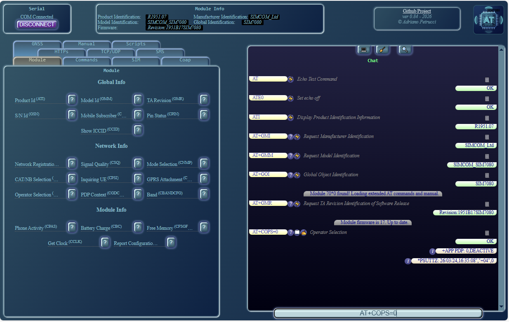
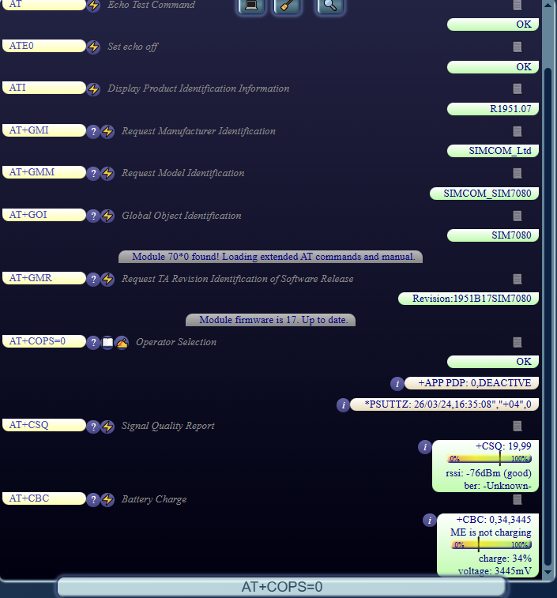
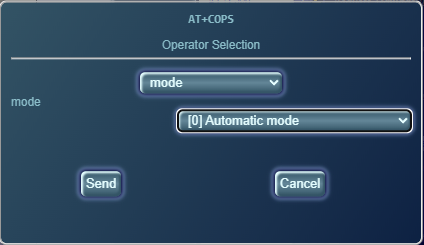
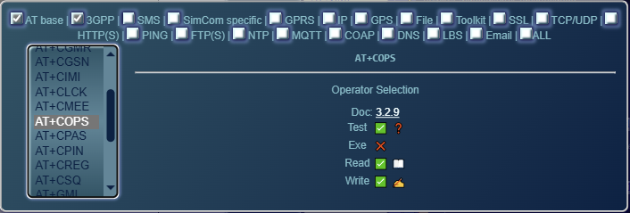
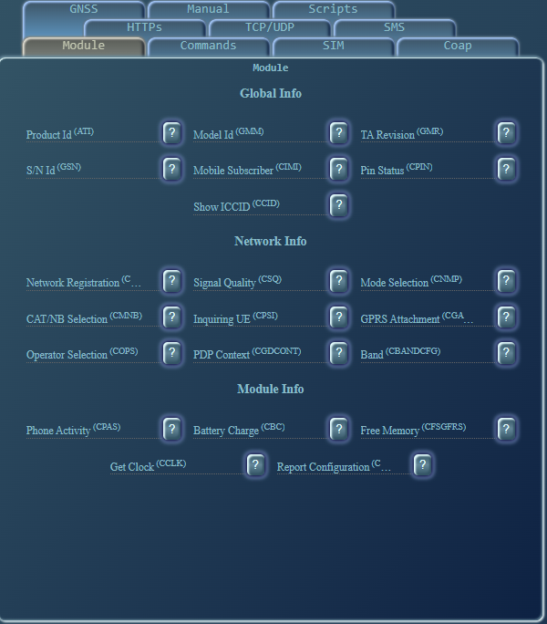
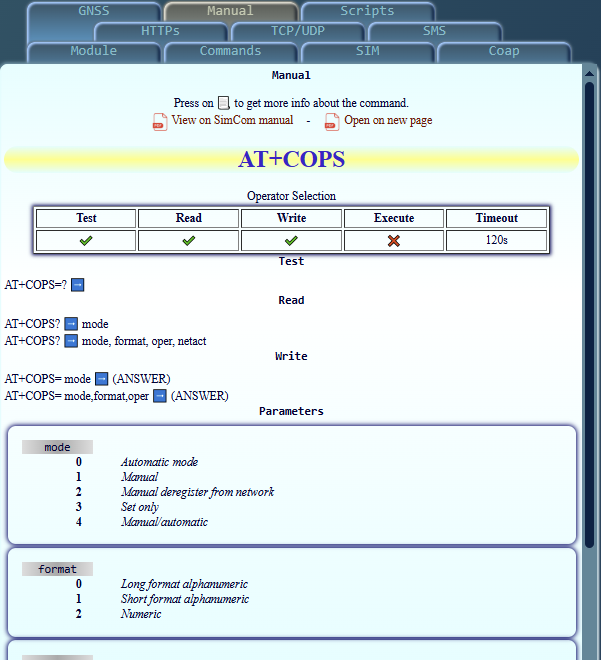
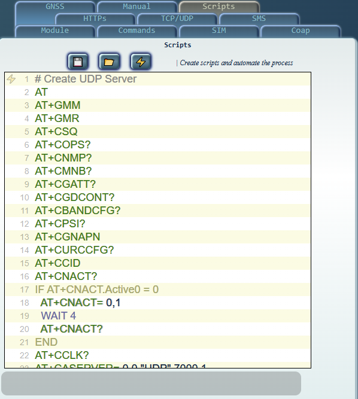

  
  
# Online SimCom Tester
This webpage allows you to send AT commands to your SimCom module directly from your browser. 
- Send AT commands to your SimCom module without leaving the webpage
- No downloads or installation required
- Comprehensive descriptions of every command, with integrated help and AT manual reference
- Check module and firmware information
  
❕ Currently, only the **SIM7080G** (SIM7070G and SIM7090G) is implemented. Other modules can be added if compatible or integrated in the future with minimal effort.  

# Setup
- Connect your module to your PC via USB or serial connection.
- Open the webpage in Edge, Chrome, or another browser that supports the Web Serial API.
- Click "Connect" and select the correct serial port in your browser (the first SimTech serial port on USB).
- If everything is connected properly, you should see something like this:

# How to use
- Open the project webpage (https://adrianotiger.github.io/simcomtester/)
- Click any predefined commands in the left panel
- Or type commands directly into the chat window
- Click "📃" to view a tutorial for that specific command

## Chat with the module

Similar to WhatsApp, type your questions and the module will respond. The answers are well-formatted and each question includes a description.
#### Buttons
❓ - Test command on the module  
⚡ - Execute command on the module
✍ - Write command using the command editor  
📖 - Read command from the module  
📃 - Open the PDF manual to the relevant page  
𝓲 - Command information (tooltip window)  
💻 - Hide chat and open the prompt-like window  
💬 - Hide prompt and open the chat  
🧹 - Clear the chat or prompt window  

#### Command editor
  
Click ✍ in the chat to open the command editor, where you can create commands with the appropriate parameters.

#### Command finder
  
Click 🔍 in the chat to open the command list. You can search for the right command and execute, test, read, or write it with the correct parameters.

## Tabs
  
Functionality is organized into tabs:  
**Module**: Basic functionality  
**Commands**: Command execution  
**SIM**: SIM-related commands (e.g., PIN management)  
**COAP**: Create COAP servers/clients and send COAP messages  
**HTTPS**: Create HTTPS servers/clients  
**TCP/UDP**: Create TCP/UDP servers/clients and send messages  
**SMS**: SMS functionality (MT/MO)  
**GNSS**: Basic GNSS functionality  
**Manual**: See Manual section  
**Scripts**: See Scripts section  

## Manual
  
Every known AT command has specific read/write parameters available on this tab. Click 📃 in the chat to navigate to the relevant section.  
You can also open the PDF on the right side of the page, so you won't need to search through the document.  

## Scripts
  
A simple text editor with syntax highlighting that allows you to send commands and wait for an OK response after each one.  
Special commands:  
- `#` to comment out a line
- `IF ... END` execute conditionally (example: `IF AT+CNACT.Active0 = 0`)  
- `WAIT X` wait X seconds  

# How to edit/test
- Create a workspace in GitHub
- Add the "Live Preview" extension from Microsoft
- Open index.html and click the "Show Preview" button in the top-right to open a browser tab
- Edit and test until you have a working version

# Issues  
I am testing a SIM7080 module, so this page includes some 7080-specific commands.

The structure should let me/us to add (without much works) more commands and to add module-specific commands.

# Credits
[Web Serial Port API (mozilla.org)](https://developer.mozilla.org/en-US/docs/Web/API/SerialPort)  
[JavaScript PDFLib (github.com)](https://github.com/mozilla/pdf.js)  
[SimCom Module (simcom.com)](https://www.simcom.com/product/SIM7080G.html)  
[Image generator (qwen.ai)](https://chat.qwen.ai/)  

Having trouble or not getting a response from the module? Try the Web Serial Terminal: https://www.serialterminal.com/
