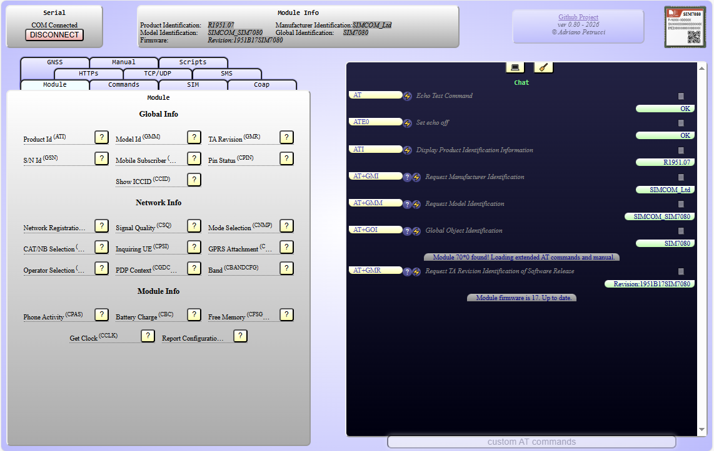
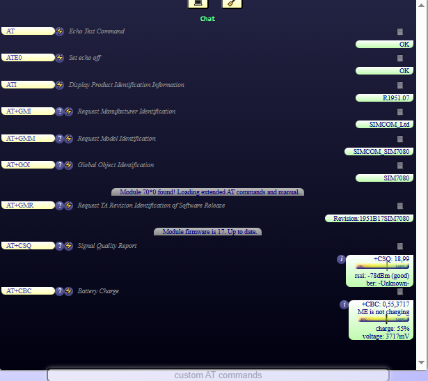
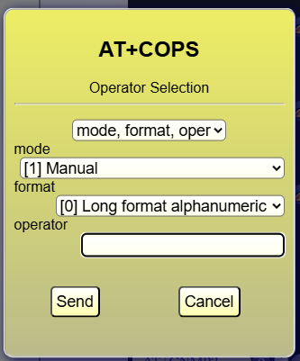
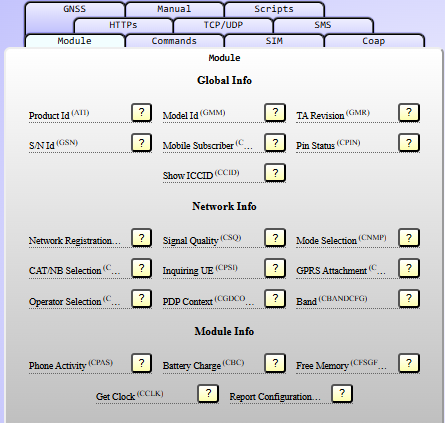
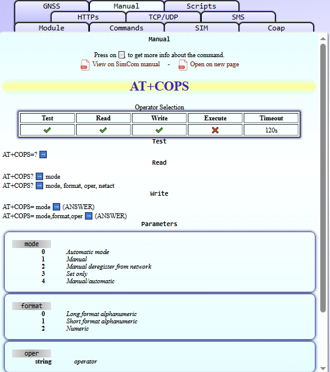
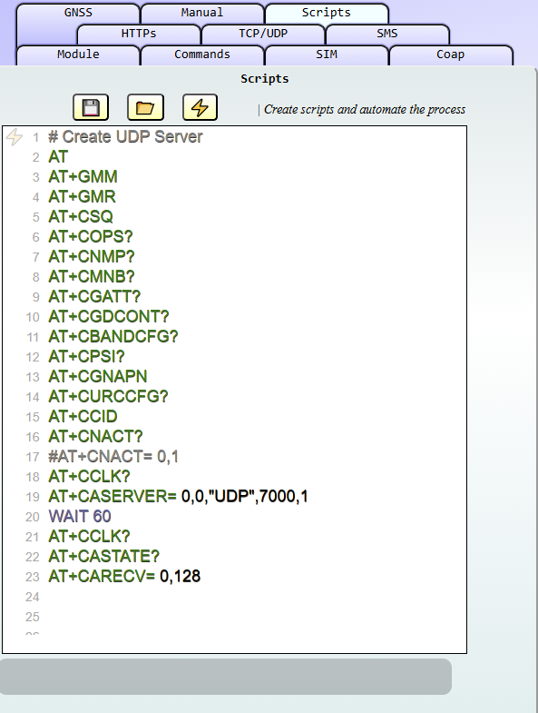

# Online SimCom Tester
This webpage will let you send some simple commands to your SimCom Module. 
- Send AT-Commands to your SimCom module directly over the webpage
- No downloads or installation
- Description of every command, with integrated help and AT-manual
- Check module and firmware
  
❕ Actually, only the **SIM7080G** (SIM7070G and SIM7090G) is implemented. Other modules can be used if compatible or can be implemented in future without much work.  

# Setup
- Connect your module with your PC (USB or Serial).
- Open the webpage with Edge, Chrome or another browser with Serial-functionality.
- Press on "Connect" and select the right serial port on your browser (the first SimTech serial port, on USB)
- If everything is connected, you should see something like this:

# How to use
- Open the project webpage (https://adrianotiger.github.io/simcomtester/)
- You can press any predefined commands on the left panel
- Or you can write the commands directly in the "chat"
- If you press on "📃" a tutorial should be visible for that command.

## Chat with the module

Like Whatsapp, write what you want to ask and the module will reply with a response. The answer is well formatted and the question has a description.  
#### Buttons
❓ - Test command on the module  
⚡ - Execute command on the module
✍ - Write command on the module using the command editor  
📖 - Read command on the module  
📃 - Open the PDF-manual on the right page  
𝓲 - Command info (tooltip-window)  
💻 - Hide chat and open the Prompt-like window  
💬 - Hide prompt and open the chat  
🧹 - Clear chat or prompt window  

#### Command editor
  
BY pressing ✍ on the chat, a command editor will be opened and you can create a command with the right parameters.

## Tabs
  
Functionality are grouped in TABS:  
Module : base functionality  
Commands: execution of commands  
SIM: SIM-related commands, like PIN  
COAP: Create server/client and COAP-messages  
HTTPS: Create server/client  
TCP/UDP: Create server/client and messages  
SMS: SMS-functionality (MT/MO)  
GNSS: Some base funtionality  
Manual: See `Manual`  
Scripts: See `Scripts`  

## Manual
  
Every known AT-command has some specific read/write parameters. You can find them on this tab, by pressing 📃 in the chat.  
You can also open the PDF on the right page, so you don't need to find it inside the document.  

## Scripts
  
Simple text editor with syntax highlightings, allow you to send the commands and wait for the OK each time.  
Special commands:  
- `#` to comment a line .  
- `IF ... END` execute if (example: `IF AT+CNACT.Active0 = 0`)  
- `WAIT X` wait X seconds  

# How to edit/test
- Create a workspace in GitHub
- Add extension "Live Preview" from Microsoft
- Open index.html and press on the right/top button "show preview", opening the browser-tab in a new window
- Edit and test it until you have a working version.

# Issues  
I am testing a SIM7080 Module, so this page has some 7080-specific commands.

The structure should let me/us to add (without much works) more commands and to add module-specific commands.

The page is not able to parse "unsolicited results". I need to integrate this functionality.

# Credits
[Web Serial Port API (mozilla.org)](https://developer.mozilla.org/en-US/docs/Web/API/SerialPort)  
[Javascript PDFLib for (github.com)](https://github.com/mozilla/pdf.js)  
[SimCom Module (simcom.com)](https://www.simcom.com/product/SIM7080G.html)  

Too complicated or module does not answer? Try a Web Serial Terminal: https://www.serialterminal.com/
